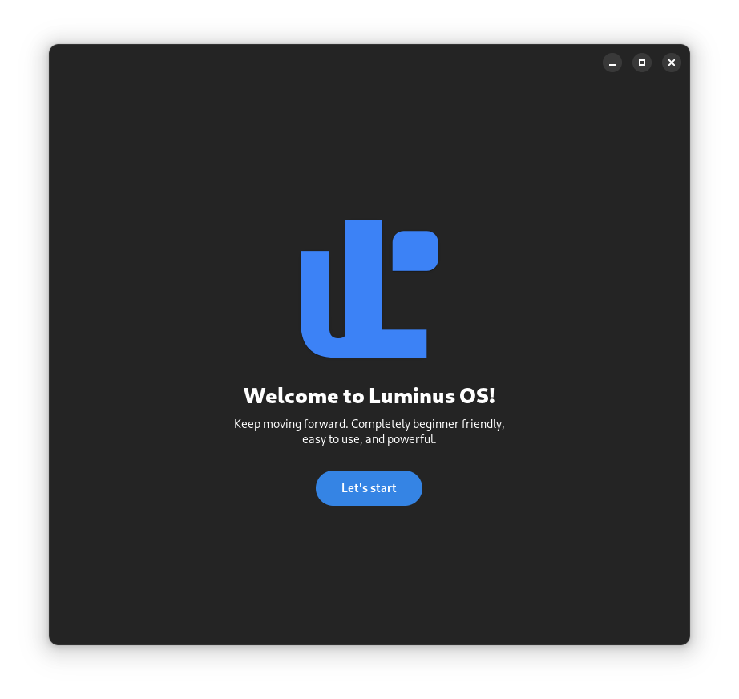

<div align="center">
    
    <h1>Welcomatic (Luminus OS First Setup)</h1>
    <p>This utility is meant to be used in <a href="https://github.com/luminusOS">Luminus OS</a>
    as a first-setup wizard. Its purpose is to help the user to configure the
    system to their needs, e.g. by configuring snap, flatpak, flathub, etc.</p>
    <hr />
    <br />
    
</div>


## Build
### Dependencies
- build-essential
- meson
- libadwaita-1-dev
- gettext
- desktop-file-utils

### Build
```bash
meson build
ninja -C build
```

### Install
```bash
sudo ninja -C build install
```

## Run
```bash
welcomatic
```

### Using custom recipes
Place a new recipe in `/etc/welcomatic/recipe.json` or launch the
utility with the `WELCOMATIC_CUSTOM_RECIPE` environment variable set to the path
of the recipe.

